# Crynux Node LXC Registry Setup Guide

## Architecture

```mermaid
graph TD
    Actions["🚀 GitHub Actions"]

    Actions -->|"SCP Upload"| RawFiles["📁 Upload Directory"]
    Actions -->|"SSH Execute"| ServerScript["⚙️ Remote Script<br/>incus-simplestreams<br/>convert"]

    RawFiles -.-> ServerScript
    ServerScript --> StaticFiles["📁 Simplestreams Directory"]

    StaticFiles --> Nginx["📡 Nginx Server"]
    Nginx --> Internet["🌐 Internet Users"]

    subgraph Server ["Registry Server"]
        RawFiles
        ServerScript
        StaticFiles
        Nginx
    end

    classDef external fill:#e8f5e8
    classDef server fill:#e1f5fe
    classDef storage fill:#fff9c4
    classDef remote fill:#fff2e0

    class Actions,Internet external
    class Nginx server
    class RawFiles,StaticFiles storage
    class ServerScript remote
```



### Architecture Design

#### **Static File Distribution**

Pure simplestreams protocol with static file serving for maximum performance and simplicity.

#### **Publishing Pipeline**

1. **Build**: GitHub Actions automatically builds LXC images using distrobuilder
2. **Upload**: Raw image files (rootfs.tar.xz + meta.tar.xz) are uploaded via SCP to server
3. **Remote Convert**: GitHub Actions executes processing script via SSH on server
4. **Deploy**: Converted simplestreams files are served as static content

#### **Distribution**

- **Static files**: Simplestreams format for efficient image distribution
- **No authentication**: Public access to all published images
- **CDN-ready**: Static files can be easily cached and distributed globally

#### **Remote Processing**

GitHub Actions remotely executes the processing script on the server via SSH. Following [official Incus documentation](https://linuxcontainers.org/incus/docs/main/reference/image_servers/), the `incus-simplestreams` tool runs with ubuntu user permissions to manage the file system tree in simplestreams format.

## Setup Steps

### 1. Install Required Packages

```bash
# Add Zabbly repository for incus-simplestreams
curl -fsSL https://pkgs.zabbly.com/key.asc | sudo gpg --dearmor -o /etc/apt/keyrings/zabbly.gpg
echo "deb [signed-by=/etc/apt/keyrings/zabbly.gpg] https://pkgs.zabbly.com/incus/stable $(lsb_release -cs) main" | sudo tee /etc/apt/sources.list.d/zabbly-incus.list

# Install ONLY incus-simplestreams tool (no incus server needed)
sudo apt update
sudo apt install -y incus-simplestreams
```

### 2 Create Directory Structure
```bash
# Create web-accessible directory structure
sudo mkdir -p /var/www/lxc/{uploads,simplestreams}
sudo chown -R ubuntu:www-data /var/www/lxc
sudo chmod -R 755 /var/www/lxc

# Set setgid bit to ensure new files inherit www-data group automatically
sudo chmod g+s /var/www/lxc/uploads /var/www/lxc/simplestreams
```

### 3. Initialize Simplestreams Repository
```bash
# Initialize the simplestreams repository (will create subdirectories automatically)
cd /var/www/lxc/simplestreams
incus-simplestreams init-repo . "crynux" "Crynux LXC Images"
```

### 4. Configure Nginx

Create Nginx configuration to serve the simplestreams files as static content:

```nginx
# /etc/nginx/conf.d/lxc.crynux.io.conf
server {
    listen 443 ssl http2;
    server_name lxc.crynux.io;

    # SSL configuration
    ssl_certificate /etc/letsencrypt/live/crynux.io/fullchain.pem;
    ssl_certificate_key /etc/letsencrypt/live/crynux.io/privkey.pem;

    # Document root for simplestreams
    root /var/www/lxc/simplestreams;
    index index.json;

    # Only allow GET and HEAD requests
    if ($request_method !~ ^(GET|HEAD)$) {
        return 405;
    }

    # Serve static files with proper content types
    location / {
        try_files $uri $uri/ $uri/index.json =404;

        # Set content type for JSON files
        location ~* \.(json)$ {
            add_header Content-Type "application/json; charset=utf-8";
        }

        # Set content type for image files
        location ~* \.(tar\.xz|squashfs|qcow2)$ {
            add_header Content-Type "application/octet-stream";
        }
    }
}
```

## GitHub Actions Setup

Configure the following secrets in your GitHub repository to enable automatic image publishing:

### Required GitHub Secrets

- `REGISTRY_HOST`
- `REGISTRY_PORT` (optional)
- `REGISTRY_USERNAME`
- `REGISTRY_SSH_KEY`

## Usage Guide

### Public Users Downloading Images

#### Using Incus

```bash
# Add public simplestreams image source
incus remote add crynux https://lxc.crynux.io --protocol=simplestreams

# List available images
incus image list crynux:

# Launch container
incus launch crynux:crynux-node:v2.6.0 my-container
```

#### Using LXD

```bash
# Add public simplestreams image source (protocol must be specified)
lxc remote add crynux https://lxc.crynux.io --protocol=simplestreams

# List available images
lxc image list crynux:

# Launch container
lxc launch crynux:crynux-node:v2.6.0 my-container
```
