# Crynux Node LXC Registry Setup Guide

## Overview

This guide shows how to set up an LXC image registry with:
- **Public image downloads**: Anyone can download images without authentication
- **Private management access**: Authenticated access for image publishing

**Note**: This guide uses [Zabbly's Incus packages](https://github.com/zabbly/incus) for Ubuntu 22.04 LTS, which provides official Incus builds via apt repositories.

## Architecture

```mermaid
graph LR
    Internet[🌐 Internet<br/>Public Users] -->|"HTTPS"| Nginx8554[Nginx Port 8554<br/>API limit: read-only images<br/>Add local cert: /home/ubuntu/incus-certs/]
    AuthClients[🔑 Authenticated Clients<br/>Management Tools] -->|"HTTPS + Client Cert"| Nginx8555[Nginx Port 8555<br/>Full Access<br/> Verifies Client Cert<br/>Add local cert: /home/ubuntu/incus-certs/]

    Nginx8554 -->|"🔗 HTTPS + mTLS<br/>Local Client Cert<br/>"| IncusServer[⚡ Incus Server<br/>Port 8553<br/>LXC Registry]
    Nginx8555 -->|"🔗 HTTPS + mTLS<br/>Local Client Cert<br/>"| IncusServer

    IncusServer --> Storage[💾 Storage Pool<br/>LXC Images]

    subgraph "LXC Registry Server"
        Nginx8554
        Nginx8555
        IncusServer
        Storage
    end

    classDef publicAccess fill:#e1f5fe
    classDef authAccess fill:#f3e5f5
    classDef server fill:#e8f5e8
    classDef storage fill:#fff3e0

    class Internet,Nginx8554 publicAccess
    class AuthClients,Nginx8555 authAccess
    class IncusServer server
    class Storage storage
```



### Architecture Design

#### **Certificate Model**

Single client certificate stored locally on server with **full Incus access permissions**.

#### **Nginx Access Control**

- **Port 8554**: Anonymous access + Nginx uses local certificate + API path restrictions = Read-only
- **Port 8555**: Client certificate verification + Nginx uses local certificate + No restrictions = Full access

#### **Certificate Verification Flow**

1. **Port 8554**: No client authentication → Nginx reads local certificate → Connects to Incus
2. **Port 8555**: Client provides certificate → Nginx verifies exact match → Nginx reads local certificate → Connects to Incus

The same local certificate is used for all Nginx-to-Incus connections regardless of the port.

## Setup Steps

### 1. Install and Configure Incus

#### 1.1 Install Incus
```bash

# Add Zabbly repository key
curl -fsSL https://pkgs.zabbly.com/key.asc | gpg --show-keys --fingerprint
mkdir -p /etc/apt/keyrings/
curl -fsSL https://pkgs.zabbly.com/key.asc -o /etc/apt/keyrings/zabbly.asc

# Add Zabbly Incus stable repository
sh -c 'cat <<EOF > /etc/apt/sources.list.d/zabbly-incus-stable.sources
Enabled: yes
Types: deb
URIs: https://pkgs.zabbly.com/incus/stable
Suites: $(. /etc/os-release && echo ${VERSION_CODENAME})
Components: main
Architectures: $(dpkg --print-architecture)
Signed-By: /etc/apt/keyrings/zabbly.asc
EOF'

# Install Incus
sudo apt update
sudo apt install -y incus
```

#### 1.2 Initialize Incus
```bash
# Initialize Incus
sudo incus admin init

# Configuration options:
# - Would you like to use LXD clustering? no
# - Do you want to configure a new storage pool? yes
# - Name of the new storage pool: default
# - Name of the storage backend to use: dir
# - Where should this storage pool store its data? /var/lib/incus/storage-pools/default (default)
# - Would you like to connect to a MAAS server? no
# - Would you like to create a new local network bridge? no (not needed for registry-only)
# - Would you like the Incus server to be available over the network? yes
# - Address to bind Incus to: all addresses
# - Port: 8553 (internal port, accessed through Nginx proxy)
```

#### 1.3 Configure Incus
```bash
# Configure Incus to listen on internal port
sudo incus config set core.https_address 127.0.0.1:8553

# Restart Incus to apply the new listening address
sudo systemctl restart incus
```

### 2. Generate Client Certificate

#### 2.1 Create Certificate Directory
```bash
mkdir -p ~/incus-certs
cd ~/incus-certs
```

#### 2.2 Generate Client Certificate
```bash
openssl req -x509 -newkey rsa:4096 \
    -keyout incus-client.key \
    -out incus-client.crt \
    -days 3650 -nodes \
    -subj "/CN=incus-client"
```

#### 2.3 Add Certificate to Incus Trust Store
```bash
# Add client certificate
sudo incus config trust add-certificate incus-client.crt --name "incus-client"

# Verify certificate
sudo incus config trust list
```

### 3. Configure Nginx

```bash
sudo tee /etc/nginx/conf.d/lxc.crynux.io.conf << 'EOF'
upstream incus_backend {
    server 127.0.0.1:8553;
}

# Public access port (8554) - Image downloads only
server {
    listen 8554 ssl http2;
    server_name lxc.crynux.io;

    # SSL configuration
    ssl_certificate /etc/letsencrypt/live/crynux.io/fullchain.pem;
    ssl_certificate_key /etc/letsencrypt/live/crynux.io/privkey.pem;

    # Allow only image-related GET requests
    location ~ ^/1\.0/images {
        if ($request_method != GET) {
            return 405;
        }

        proxy_pass https://incus_backend;
        proxy_ssl_certificate /home/ubuntu/incus-certs/incus-client.crt;
        proxy_ssl_certificate_key /home/ubuntu/incus-certs/incus-client.key;
        proxy_ssl_verify off;
        proxy_ssl_protocols TLSv1.2 TLSv1.3;
        proxy_ssl_ciphers HIGH:!aNULL:!MD5;

        proxy_set_header Host $host;
        proxy_set_header X-Real-IP $remote_addr;
        proxy_set_header X-Forwarded-For $proxy_add_x_forwarded_for;
        proxy_set_header X-Forwarded-Proto $scheme;
    }

    # Allow access to server information
    location = /1.0 {
        if ($request_method != GET) {
            return 405;
        }

        proxy_pass https://incus_backend;
        proxy_ssl_certificate /home/ubuntu/incus-certs/incus-client.crt;
        proxy_ssl_certificate_key /home/ubuntu/incus-certs/incus-client.key;
        proxy_ssl_verify off;
        proxy_ssl_protocols TLSv1.2 TLSv1.3;
        proxy_ssl_ciphers HIGH:!aNULL:!MD5;

        proxy_set_header Host $host;
        proxy_set_header X-Real-IP $remote_addr;
        proxy_set_header X-Forwarded-For $proxy_add_x_forwarded_for;
        proxy_set_header X-Forwarded-Proto $scheme;
    }

    # Deny all other requests
    location / {
        return 403 "Public access limited to image downloads only";
    }
}

# Management port (8555) - Full access permissions
server {
    listen 8555 ssl http2;
    server_name lxc.crynux.io;

    # SSL configuration
    ssl_certificate /etc/letsencrypt/live/crynux.io/fullchain.pem;
    ssl_certificate_key /etc/letsencrypt/live/crynux.io/privkey.pem;

    # Require client certificate authentication
    ssl_client_certificate /home/ubuntu/incus-certs/incus-client.crt;
    ssl_verify_client on;

    # Forward all requests to Incus
    location / {
        proxy_pass https://incus_backend;
        proxy_ssl_verify off;
        proxy_ssl_protocols TLSv1.2 TLSv1.3;
        proxy_ssl_ciphers HIGH:!aNULL:!MD5;

        proxy_set_header SSL-Client-Cert $ssl_client_cert;
        proxy_set_header Host $host;
        proxy_set_header X-Real-IP $remote_addr;
        proxy_set_header X-Forwarded-For $proxy_add_x_forwarded_for;
        proxy_set_header X-Forwarded-Proto $scheme;
    }
}
EOF
```

## Usage Guide

### Public Users Downloading Images

```bash
# Add public image source
incus remote add crynux-network https://lxc.crynux.io:8554 --public

# List available images
incus image list crynux-network:

# Launch container
incus launch crynux-network:crynux-node:v2.6.0 my-container
```

### Administrators Publishing Images

```bash
# Setup client certificates
mkdir -p ~/.config/incus
cp incus-client.crt ~/.config/incus/client.crt
cp incus-client.key ~/.config/incus/client.key
chmod 600 ~/.config/incus/client.key
chmod 644 ~/.config/incus/client.crt

# Add management remote
incus remote add crynux-network-admin https://lxc.crynux.io:8555 --accept-certificate

# Publish image (requires both metadata and rootfs)
incus image import meta.tar.xz rootfs.tar.xz crynux-network-admin: \
  --alias "crynux-node:v2.6.0" \
  --public
```
